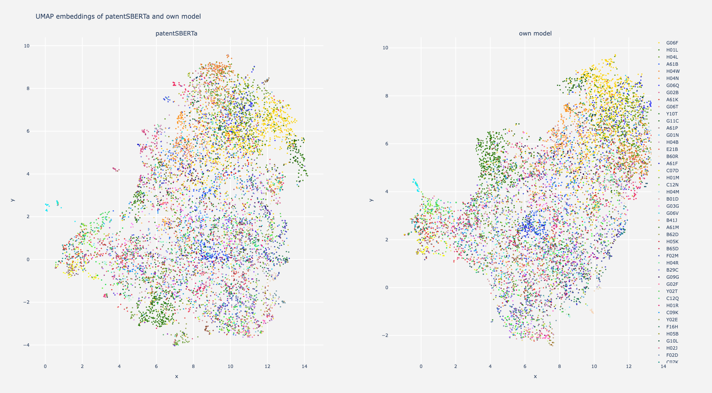

# PatentCL - Patent Classification with Transformers
PatentCL is a fine-tuned version of the already great [AI-Growth-Lab/PatentSBERTa](https://huggingface.co/AI-Growth-Lab/PatentSBERTa) model. It is trained on the [PatentsView](https://patentsview.org/) Dataset (USPTO Data) by leveraging contrastive learning.
The model is trained to classify patents with the [Cooperative Patent Classification (CPC)](https://www.epo.org/searching-for-patents/helpful-resources/first-time-here/classification/cpc.html). It takes in the patent title as well as the abstract (concatenated with a special token in between) and outputs a 768-dim embedding vector representation of the patent. This vector representation can be used to find similar patents or to cluster patents.
Similar aproaches were done by [SPECTER](https://arxiv.org/abs/2004.07180) and [SciNCL](https://arxiv.org/abs/2202.06671) on scientific publications.



## Usage
The folder `training_scripts` contains three python files to restructure, preprocess and train the model.

##### 1. `patent_handler.py` (iPython Notebook)
The `patent_handler.py` script is used to restructure the raw data from the PatentsView dataset. It requires three `.tsv` files from PatentsView:
- [g_patent](https://s3.amazonaws.com/data.patentsview.org/download/g_patent.tsv.zip)
- [g_us_patent_citation](https://s3.amazonaws.com/data.patentsview.org/download/g_us_patent_citation.tsv.zip)
- [g_cpc_current](https://s3.amazonaws.com/data.patentsview.org/download/g_cpc_current.tsv.zip)

There is another file that greatly helps with the restructuring process by providing a full list of CPC Classes but is not listed on the PatentsView website: [cpc_group](https://s3.amazonaws.com/data.patentsview.org/download/cpc_group.tsv.zip)

If the links are not working, visit the [PatentsView](https://patentsview.org/download/data-download-tables) website and download the files manually.

Download the zipped files and extract them into the `data` folder. Open the iPython Notebook `patent_handler.ipynb` and run the cells. The notebook will output several csv files which can be used to import the data into a neo4j database. More information on the import can be found inside the notebook. Finally, the notebook can make a carefully crafted cypher query to extract the training data for the conrastive learning algorithm.

##### 2. `patent_triplet_trainer.py` (Python Script)
The `patent_triplet_trainer.py` script is used to train the model. It requires the training data from the previous step. The script will train the model and save it to the `models` folder. The script can be run with the following command:
```
python patent_triplet_trainer.py
```
Please consider using `tmux` or `screen` to run the script in the background.

##### 3. `patent_embedding_scatter.ipynb` (iPython Notebook)
The `patent_embedding_scatter.ipynb` notebook can be used to compare own models with already existing models. It requires the model from the previous step. The notebook will output a scatter plot of the embeddings of the patents. It can be easily modified to calculate several metrices.


## Training
The model was trained on a single A4500 GPU. The following models were created:
- [patentCL-10K (10K triplet samples, 10 epochs)](https://huggingface.co/TUHH-TIE/patentCL-10K)
- patentCL-100K (100K triplet samples, 10 epochs)
- patentCL-1M (1M triplet samples, 10 epochs)
- patentCL-FULL (all 8.5M triplet samples, 10 epochs)

Keep in mind, that this project is a work in progress and we will update the links here when the models have finished the training.

You can access the models on the [HuggingFace Hub TIE Page]([https://huggingface.co/](https://huggingface.co/TUHH-TIE)). The models can be used with the [Sentence-Transformers](https://www.sbert.net/index.html) library.
The training script can be found in the `training_scripts` folder. The training script utilizes the [Sentence-Transformers](https://www.sbert.net/index.html) library.